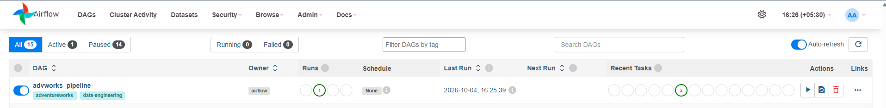
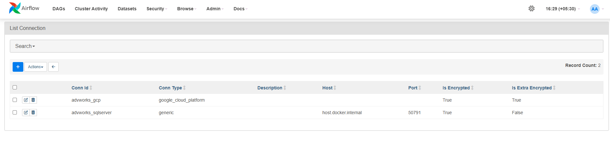
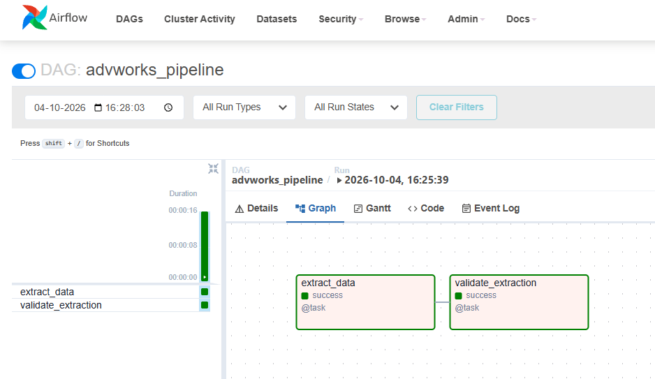
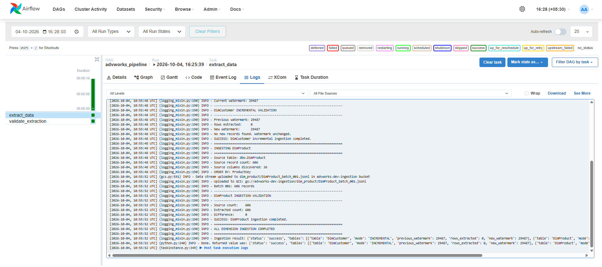
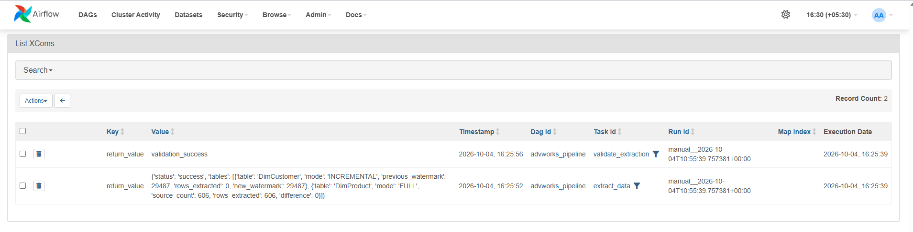

# End-to-End Data Engineering Platform

A production-style **end-to-end Data Engineering portfolio project** built using the AdventureWorksDW2022 dataset.

The project demonstrates how data can be extracted from an operational SQL Server database, moved through a cloud-based ingestion platform, automatically loaded into Snowflake, transformed into analytics-ready dimensional models, and exposed for downstream BI consumption.

The platform also implements **Infrastructure as Code, environment isolation, CI/CD, federated authentication, data-quality validation, historical tracking, CDC, retry/idempotency patterns, and operational validation**.

---

## Project at a Glance

| Area                | Implementation                    |
| ------------------- | --------------------------------- |
| Source              | SQL Server / AdventureWorksDW2022 |
| Extraction          | Python / pyodbc                   |
| Orchestration       | Apache Airflow                    |
| Raw Storage         | Google Cloud Storage              |
| Eventing            | Google Pub/Sub                    |
| Warehouse           | Snowflake                         |
| Automated Ingestion | Snowpipe                          |
| Transformation      | dbt                               |
| Modeling            | Dimensional / Star Schema         |
| CDC                 | Snowflake Streams + Tasks         |
| Historical Tracking | dbt Snapshot / SCD Type 2         |
| Infrastructure      | Terraform                         |
| Remote State        | GCS                               |
| CI/CD               | Azure DevOps                      |
| Authentication      | Workload Identity Federation      |
| Source Control      | Git / GitHub                      |
| BI                  | Tableau / Power BI                |

**Project status: ✅ Core implementation completed and validated**

---

# 1. What Problem Does This Project Solve?

A common Data Engineering problem is moving data from operational systems into an analytics platform in a way that is:

* reliable
* repeatable
* scalable
* observable
* secure
* maintainable
* cost-aware
* easy to deploy across environments

A simple solution could be:

```text
SQL Server → Python → CSV → Warehouse
```

However, that approach does not adequately demonstrate how a modern enterprise data platform handles:

* orchestration
* cloud storage
* event-driven ingestion
* schema and transformation layers
* data quality
* historical data
* change processing
* infrastructure management
* environment promotion
* authentication
* failure recovery
* operational validation

This project was therefore designed as a **complete Data Engineering platform rather than a single ETL script**.

The objective was to build the platform end to end and demonstrate how the individual components work together as an architecture.

---

# 2. Business / Engineering Objective

The primary objective was to take data from an existing SQL Server warehouse and build a reliable analytical data platform around it.

The target flow is:

```text
Operational / Source Database
            ↓
       Data Extraction
            ↓
      Orchestration
            ↓
      Cloud Raw Storage
            ↓
      Event Notification
            ↓
    Automated Warehouse Load
            ↓
       Raw Warehouse
            ↓
      Transformation Layers
            ↓
      Dimensional Model
            ↓
     Business-ready Data
            ↓
       BI / Analytics
```

The platform additionally needed to support:

```text
Infrastructure as Code
Environment Isolation
CI/CD
Federated Authentication
Data Quality
CDC
Historical Tracking
Retry / Idempotency
Operational Validation
```

---

# 3. Final Architecture

## Runtime Data Architecture

```text
┌─────────────────────────────┐
│ SQL Server                  │
│ AdventureWorksDW2022        │
└─────────────┬───────────────┘
              │
              │ Python extraction
              ▼
┌─────────────────────────────┐
│ Apache Airflow              │
│ Source ingestion            │
│ orchestration               │
└─────────────┬───────────────┘
              │
              │ JSON / JSONL
              ▼
┌─────────────────────────────┐
│ Google Cloud Storage        │
│ Raw / durable storage       │
└─────────────┬───────────────┘
              │
              │ Object-created event
              ▼
┌─────────────────────────────┐
│ Google Pub/Sub              │
│ Event notification          │
└─────────────┬───────────────┘
              │
              │ Notification
              ▼
┌─────────────────────────────┐
│ Snowpipe                    │
│ Automated ingestion         │
└─────────────┬───────────────┘
              │
              ▼
┌────────────────────────────────────────────┐
│ Snowflake                                  │
│                                            │
│ LANDING                                    │
│     ↓                                      │
│ PREPARE                                    │
│     ↓                                      │
│ NORMALIZE                                  │
│     ↓                                      │
│ SCHEMATIZE                                 │
│     ↓                                      │
│ MARKETPLACE                                │
└─────────────────────┬──────────────────────┘
                      │
                      ▼
              Tableau / Power BI
```

### Supporting Engineering Platform

```text
                    GitHub
                       │
                       ▼
                Azure DevOps
                       │
          ┌────────────┼────────────┐
          ▼            ▼            ▼
       Python         dbt       Terraform
       validation   validation   validation
                       │
                       ▼
                    WIF/OIDC
                       │
                       ▼
                 Google Cloud
```

**Important architectural separation:**

* **Airflow** handles source ingestion orchestration.
* **GCS** provides durable raw object storage.
* **Pub/Sub** provides event notification.
* **Snowpipe** handles automated warehouse ingestion.
* **Snowflake** provides warehouse storage and compute.
* **dbt** handles transformation and analytical modeling.
* **Terraform** manages infrastructure.
* **Azure DevOps** handles CI/CD and infrastructure deployment.
* **Workload Identity Federation** provides secure CI/CD authentication.

This separation keeps individual components focused on their intended responsibility.

---

# 4. Why This Architecture?

The architecture was intentionally designed around several Data Architecture principles.

## 4.1 Decoupling

The source database is not directly coupled to Snowflake.

```text
SQL Server
    ↓
Python
    ↓
GCS
    ↓
Snowflake
```

GCS acts as a durable boundary between extraction and warehouse ingestion.

This allows files to be:

* retained
* validated
* replayed
* reprocessed
* inspected independently of the source system

---

## 4.2 Event-driven ingestion

Instead of continuously polling Snowflake for new files:

```text
GCS object created
        ↓
Pub/Sub event
        ↓
Snowpipe
        ↓
Snowflake
```

The warehouse ingestion process is triggered by the arrival of new data.

This reduces unnecessary polling and creates a more responsive ingestion architecture.

---

## 4.3 Layered warehouse design

Data is not transformed immediately into business tables.

Instead:

```text
LANDING
   ↓
PREPARE
   ↓
NORMALIZE
   ↓
SCHEMATIZE
   ↓
MARKETPLACE
```

Each layer has a clear responsibility.

This improves:

* maintainability
* debugging
* lineage
* data quality
* reprocessing
* separation of concerns

---

## 4.4 Infrastructure as Code

Snowflake infrastructure is managed using Terraform rather than manually creating every object.

This makes environments reproducible and allows infrastructure changes to be reviewed through version control and deployment pipelines.

---

## 4.5 Environment isolation

The platform separates:

```text
DEV
TEST
PRE-PROD
PROD
```

with corresponding Snowflake databases and warehouses.

Terraform state is also separated by environment.

---

# 5. Source System

The source is the Microsoft AdventureWorksDW2022 sample warehouse running on SQL Server.

```text
SQL Server
    │
    └── AdventureWorksDW2022
```

Primary source tables:

```text
dbo.DimCustomer
dbo.DimProduct
dbo.FactInternetSales
```

Source configuration used during development:

```text
Server: CHETAN\SQLSERVER2022
Database: AdventureWorksDW2022
Driver: ODBC Driver 17 for SQL Server
Authentication: Windows Authentication
```

The source was intentionally treated as an external operational system rather than modifying it to accommodate downstream processing.

---

# 6. Implementation Approach

The project was implemented progressively from source extraction through infrastructure automation.

The implementation sequence was:

```text
1. Source connectivity
        ↓
2. Python extraction
        ↓
3. Extraction validation
        ↓
4. GCS raw ingestion
        ↓
5. Airflow orchestration
        ↓
6. Pub/Sub event notification
        ↓
7. Snowpipe ingestion
        ↓
8. Snowflake layered architecture
        ↓
9. dbt transformations
        ↓
10. Dimensional modeling
        ↓
11. Data-quality validation
        ↓
12. SCD Type 2
        ↓
13. CDC with Streams + Tasks
        ↓
14. Terraform infrastructure
        ↓
15. Remote Terraform state
        ↓
16. Environment separation
        ↓
17. Azure DevOps CI/CD
        ↓
18. Workload Identity Federation
        ↓
19. End-to-end validation
```

The project was developed and validated incrementally rather than attempting to build the entire architecture at once.

---

# 7. Python Extraction

Python is responsible for extracting data from SQL Server and generating files suitable for cloud ingestion.

Implemented capabilities:

* SQL Server connectivity
* pyodbc
* batch extraction
* deterministic ordering
* JSON generation
* JSONL generation
* row-count validation
* duplicate detection
* extraction validation
* reusable storage abstraction
* error handling

## FactInternetSales extraction

One of the larger source tables used in the project was:

```text
dbo.FactInternetSales
```

Validation:

```text
Source rows:          60,398
Batch size:            5,000
Generated files:          13
Format:                 JSONL
Duplicate order lines:     0
```

Deterministic ordering was implemented using:

```text
SalesOrderNumber
SalesOrderLineNumber
```

This makes extraction reproducible and simplifies validation and reprocessing.

---

# 8. Raw Data Storage — Google Cloud Storage

Extracted files are uploaded to GCS before being loaded into Snowflake.

Example bucket:

```text
gs://advworks-dev-ingestion/
```

Example organization:

```text
advworks-dev-ingestion/

├── customer/
│   └── YYYY/MM/DD/
│
└── fact_internet_sales/
    └── YYYY/MM/DD/
```

The raw layer provides a durable copy of extracted data.

This creates an important recovery boundary:

```text
SQL Server
     ↓
    GCS
     ↓
 Snowflake
```

If downstream processing fails, the raw object can be used for replay without requiring another extraction from the source.

---

# 9. Apache Airflow

Airflow is used for **orchestration of source ingestion**.

The implemented flow is:

```text
Extract
   ↓
Validate
   ↓
Generate JSONL
   ↓
Upload to GCS
   ↓
Validate GCS object
```

Airflow provides:

* task dependency management
* scheduling
* retries
* failure handling
* logging
* task-level monitoring
* idempotent processing patterns
* reprocessing capabilities

Airflow was deliberately not used as the warehouse transformation engine.

That responsibility belongs to dbt.

---

# 10. Event-Driven Ingestion

Once an object arrives in GCS, the next part of the pipeline is event-driven.

```text
GCS Object Created
        ↓
Google Pub/Sub
        ↓
Snowflake Notification Integration
        ↓
Snowpipe
        ↓
Snowflake LANDING
```

This removes the need for the warehouse ingestion process to continuously poll for files.

The implementation was validated end to end using:

```text
GCS
 ↓
Pub/Sub
 ↓
Snowpipe
 ↓
ADVWORKS_DEV.LANDING.DIM_CUSTOMER
```

The validation included:

* event generation
* notification delivery
* Snowpipe ingestion
* loaded row count
* source-file lineage
* pending-file count
* successful completion of the ingestion flow

---

# 11. Snowflake Architecture

Snowflake is used as the analytical warehouse.

Environments:

```text
ADVWORKS_DEV
ADVWORKS_TEST
ADVWORKS_PREPROD
ADVWORKS_PROD
```

Warehouses:

```text
ETL_WH_DEV
ETL_WH_TEST
ETL_WH_PREPROD
ETL_WH_PROD
```

Schemas:

```text
LANDING
PREPARE
NORMALIZE
SCHEMATIZE
MARKETPLACE
```

---

# 12. Snowflake Landing Architecture

Snowpipe loads raw JSON/JSONL data into the LANDING layer.

```text
GCS
 ↓
External Stage
 ↓
File Format
 ↓
Snowpipe
 ↓
LANDING
```

The landing layer preserves the source-oriented representation and metadata needed for downstream processing and traceability.

Implemented concepts include:

* external stages
* storage integrations
* file formats
* Snowpipe
* load history
* file tracking
* source-file lineage
* ingestion validation
* error handling

---

# 13. dbt Transformation Architecture

The transformation architecture follows a layered approach.

```text
LANDING
   ↓
PREPARE
   ↓
NORMALIZE
   ↓
SCHEMATIZE
   ↓
MARKETPLACE
```

## PREPARE

Purpose:

Convert semi-structured source data into usable relational structures.

Responsibilities:

* parse VARIANT data
* cast fields
* standardize data types
* expose relational columns
* retain source metadata

---

## NORMALIZE

Purpose:

Prepare clean and consistent data for analytical modeling.

Responsibilities:

* cleansing
* trimming
* casing
* deduplication
* latest-record selection
* type standardization

---

## SCHEMATIZE

Purpose:

Create analytical dimensions and facts.

Responsibilities:

* dimensional modeling
* fact construction
* dimension construction
* business keys
* analytical relationships

---

## MARKETPLACE

Purpose:

Expose business-ready datasets for downstream consumers.

Responsibilities:

* simplified analytical datasets
* business-facing structures
* BI-ready outputs

---

# 14. Data Volumes and Validation

Validated model counts:

```text
PREPARE
--------
Customer       18,484
Product           606
Fact           60,398

NORMALIZE
---------
Customer       18,484
Product           606
Fact           60,398

SCHEMATIZE
----------
Customer       18,484
Product           606
Date           10,000
Fact           60,398

MARKETPLACE
-----------
Fact           60,398
```

The counts were used as part of downstream validation to ensure that transformation stages did not unintentionally lose or duplicate records.

---

# 15. Dimensional Model

The analytical model follows a star-schema approach.

Core dimensions:

```text
DIM_CUSTOMER
DIM_PRODUCT
DIM_DATE
```

Core fact:

```text
FACT_INTERNET_SALES
```

Conceptually:

```text
                DIM_CUSTOMER
                     │
                     │
                     ▼
DIM_PRODUCT ───► FACT_INTERNET_SALES ◄─── DIM_DATE
                     │
                     ▼
                BI / Analytics
```

The model separates:

* descriptive attributes
* measurable business events
* business keys
* analytical relationships

This makes the final data easier for BI tools and analytical consumers to query.

---

# 16. Data Quality

Data quality was treated as part of the pipeline rather than as a separate manual activity.

Validation included:

* duplicate detection
* row-count validation
* referential integrity
* fact/dimension integrity
* business-level checks
* dbt tests

Validated result:

```text
dbt tests: 4 / 4 passed
```

The pipeline therefore validates data at multiple stages:

```text
Source
  ↓
Extraction validation
  ↓
GCS validation
  ↓
Snowpipe validation
  ↓
dbt transformation
  ↓
dbt tests
  ↓
Dimensional model validation
```

---

# 17. Historical Tracking — dbt Snapshot / SCD Type 2

A dbt Snapshot was implemented to demonstrate historical tracking of changing customer attributes.

Conceptually:

```text
Current Record
      ↓
Business Change
      ↓
Close Existing Version
      ↓
Create New Version
```

The snapshot uses metadata such as:

```text
DBT_SCD_ID
DBT_UPDATED_AT
DBT_VALID_FROM
DBT_VALID_TO
```

A controlled test changed customer `11000`:

```text
YEARLY_INCOME

90,000
   ↓
95,000
```

The resulting history contained:

```text
Version 1
YEARLY_INCOME = 90000
DBT_VALID_TO  = change timestamp

Version 2
YEARLY_INCOME = 95000
DBT_VALID_TO  = NULL
```

Validation:

```text
CUSTOMER_KEY       = 11000
VERSION_COUNT      = 2
CURRENT_VERSION   = 1
```

### Production consideration

For a real production implementation, the preferred change timestamp should come from the source business change mechanism rather than relying only on an ingestion timestamp.

Otherwise, re-ingestion of unchanged records with a new load timestamp can incorrectly appear to be a business change.

---

# 18. Change Data Capture — Snowflake Streams and Tasks

The project also implements warehouse-side CDC processing.

Architecture:

```text
Normalized Table
      ↓
Snowflake Stream
      ↓
Snowflake Task
      ↓
CDC Target
```

The implementation was validated for:

```text
INSERT
UPDATE
DELETE
```

Snowflake update behavior was explicitly handled:

```text
DELETE + ISUPDATE = TRUE
        +
INSERT + ISUPDATE = TRUE
```

The processing logic distinguishes:

```text
INSERT + ISUPDATE=FALSE → INSERT

INSERT + ISUPDATE=TRUE  → UPDATE

DELETE + ISUPDATE=FALSE → DELETE

DELETE + ISUPDATE=TRUE  → Ignore update's delete half
```

The CDC implementation was validated through:

* successful task execution
* insert propagation
* update propagation
* delete propagation
* stream consumption
* target-table validation
* `SYSTEM$STREAM_HAS_DATA()` returning `FALSE`

This demonstrates the distinction between:

```text
Batch / Incremental Processing
        vs
Change Data Capture
        vs
Historical Tracking
```

These mechanisms solve different architectural problems.

---

# 19. Infrastructure as Code — Terraform

Snowflake infrastructure is managed using Terraform.

Implemented resources include:

* databases
* schemas
* warehouses
* stages
* file formats
* Snowpipes
* notification integrations
* environment-specific configuration
* remote state
* GCS backend
* state isolation
* deployment plans

Versions used:

```text
Terraform:          1.15.8
Snowflake Provider: 2.20.0
```

The objective was to make infrastructure:

```text
Repeatable
Version controlled
Reviewable
Environment aware
Recoverable
```

---

# 20. Environment Strategy

The project separates environments:

```text
DEV
 ↓
TEST
 ↓
PRE-PROD
 ↓
PROD
```

Snowflake databases:

```text
ADVWORKS_DEV
ADVWORKS_TEST
ADVWORKS_PREPROD
ADVWORKS_PROD
```

Terraform state is isolated:

```text
terraform/state/dev
terraform/state/test
terraform/state/preprod
terraform/state/prod
```

This prevents one environment's state from being accidentally mixed with another environment.

---

# 21. Remote Terraform State

Terraform state is stored remotely in GCS.

```text
gs://electric-tesla-507710-k2-tfstate/
```

Example state paths:

```text
terraform/state/dev/default.tfstate
terraform/state/test/default.tfstate
terraform/state/preprod/default.tfstate
terraform/state/prod/default.tfstate
```

Remote state provides a shared and persistent source of infrastructure state rather than relying on local state files.

---

# 22. CI/CD — Azure DevOps

Azure DevOps is used for deployment automation and environment promotion.

The pipeline validates:

```text
Python
dbt
Terraform
GCP authentication
Terraform initialization
Terraform plan
Terraform apply
```

The deployment flow is:

```text
GitHub
   ↓
Azure DevOps
   ↓
Python Validation
   ↓
dbt Validation
   ↓
Terraform Validation
   ↓
WIF Authentication
   ↓
Terraform Plan
   ↓
Environment Approval
   ↓
Terraform Apply
```

Environment promotion:

```text
DEV
 ↓
TEST
 ↓
PRE-PROD
 ↓
PROD
```

The key architectural point is that **Azure DevOps is a deployment/control-plane component, not part of the runtime data path**.

---

# 23. Secure CI/CD Authentication — Workload Identity Federation

The project uses Workload Identity Federation rather than storing a long-lived GCP service-account key in Azure DevOps.

```text
Azure DevOps
      │
      │ OIDC
      ▼
Workload Identity Provider
      │
      ▼
Workload Identity Pool
      │
      ▼
GCP Service Account
      │
      ▼
GCP Resources
```

This provides:

* federated authentication
* short-lived credentials
* reduced secret exposure
* no long-lived service-account key
* better alignment with enterprise cloud security practices

---

# 24. Security Design

Security was considered across the platform.

Implemented/practiced controls include:

### Secrets

* private keys excluded from Git
* passphrases excluded from Git
* secret variables in CI/CD
* secure files
* sensitive configuration outside source control

### Cloud authentication

* Workload Identity Federation
* OIDC
* service-account impersonation
* IAM

### Environment isolation

```text
DEV
TEST
PRE-PROD
PROD
```

### Snowflake

* environment separation
* warehouse separation
* RBAC concepts
* controlled access patterns

The repository intentionally does not contain credentials or private keys.

---

# 25. Reliability Design

The pipeline was designed around the assumption that failures will occur.

Examples include:

```text
Network failure
Source database unavailable
Duplicate file
Partial upload
Partial ingestion
Transformation failure
Data-quality failure
Downstream outage
Authentication failure
```

The project therefore incorporates:

* retries
* validation
* idempotent processing patterns
* deterministic extraction
* checkpoints
* file tracking
* source-file lineage
* replay/reprocessing concepts
* environment isolation
* infrastructure state management

A simplified recovery model is:

```text
Data arrives
    ↓
Validate
    ↓
Process
    ↓
Success
    │
    └── Failure
          ↓
        Retry
          ↓
      Reprocess
          ↓
        Recover
```

The GCS raw layer is particularly important because it creates a durable recovery boundary between extraction and warehouse ingestion.

---

# 26. Scalability Considerations

The project is a practice implementation, but the architecture intentionally uses patterns that support scaling.

### Extraction

Batch extraction prevents loading an entire source table into memory.

### Storage

GCS provides scalable object storage and decouples extraction from warehouse ingestion.

### Eventing

Pub/Sub allows ingestion events to be handled asynchronously.

### Snowpipe

Automated ingestion avoids manual file loading.

### Transformation

dbt pushes transformation work into the analytical warehouse.

### Airflow

Tasks can be scheduled, retried and parallelized depending on deployment configuration.

### Infrastructure

Terraform allows additional environments and infrastructure resources to be reproduced consistently.

The project therefore demonstrates scalability patterns without claiming production-scale throughput testing.

---

# 27. Performance and Cost Considerations

Performance and cost were considered at each major layer.

## Python

* batch sizing
* deterministic extraction
* memory usage
* incremental extraction concepts

## GCS

* object organization
* file sizing
* partitioning
* compression considerations

## Snowflake

* warehouse sizing
* auto-suspend
* auto-resume
* query optimization
* micro-partition awareness
* clustering considerations
* warehouse cost awareness

## dbt

* materialization selection
* incremental processing
* transformation pushdown
* avoiding unnecessary full refreshes

## Airflow

* task concurrency
* scheduling
* retry configuration
* executor considerations

---

# 28. Monitoring and Operational Validation

The project implements **foundation-level operational monitoring and validation** rather than claiming to be a fully managed enterprise 24x7 observability platform.

Validation points include:

```text
Airflow task execution
        ↓
GCS object existence
        ↓
Pub/Sub event
        ↓
Snowpipe ingestion
        ↓
Snowflake load status
        ↓
dbt execution
        ↓
dbt tests
        ↓
CDC task execution
```

Important production metrics identified include:

```text
Pipeline duration
Data freshness
Rows processed
Rows rejected
Failed tasks
Snowpipe pending files
dbt test failures
SLA status
```

---

# 29. Key Engineering Challenges

The project was not built as a collection of isolated tutorials. Several implementation challenges required troubleshooting and architectural decisions.

## Challenge 1 — Reliable source extraction

### Problem

Large source tables cannot always be extracted as one in-memory operation.

### Solution

Implemented batch extraction with deterministic ordering and validation.

```text
Source
 ↓
Batch extraction
 ↓
JSONL
 ↓
Row-count validation
 ↓
Duplicate validation
```

---

## Challenge 2 — Decoupling extraction from warehouse ingestion

### Problem

Direct source-to-warehouse loading creates tight coupling between the operational database and analytical platform.

### Solution

Introduced GCS as the durable raw boundary.

```text
SQL Server
   ↓
GCS
   ↓
Snowflake
```

This also enables replay and reprocessing.

---

## Challenge 3 — Event-driven Snowflake ingestion

### Problem

The warehouse should not depend on manual file loading.

### Solution

Implemented:

```text
GCS
 ↓
Pub/Sub
 ↓
Snowpipe
 ↓
Snowflake
```

and validated the end-to-end event path.

---

## Challenge 4 — Maintaining transformation boundaries

### Problem

Putting all transformation logic into one large SQL model makes debugging and maintenance difficult.

### Solution

Separated transformations into:

```text
PREPARE
NORMALIZE
SCHEMATIZE
MARKETPLACE
```

Each layer has a specific purpose.

---

## Challenge 5 — Historical data

### Problem

A normal dimension table only represents current state.

### Solution

Implemented dbt Snapshot / SCD Type 2.

```text
Old version
     ↓
Close version
     ↓
New version
```

---

## Challenge 6 — Warehouse CDC semantics

### Problem

Snowflake represents updates in a stream as paired delete/insert records.

### Solution

Explicitly handled:

```text
INSERT
UPDATE
DELETE
```

using `METADATA$ACTION` and `METADATA$ISUPDATE`.

---

## Challenge 7 — Reproducible infrastructure

### Problem

Manually creating infrastructure across multiple environments introduces configuration drift.

### Solution

Moved infrastructure into Terraform with isolated remote state.

---

## Challenge 8 — CI/CD cloud authentication

### Problem

Using long-lived service-account keys creates unnecessary credential-management risk.

### Solution

Implemented Azure DevOps OIDC → GCP Workload Identity Federation.

---

# 30. End-to-End Validation

The final implementation was validated progressively.

### Source

```text
SQL Server connectivity              ✅
Python extraction                    ✅
Batch processing                     ✅
JSON / JSONL generation              ✅
Duplicate validation                 ✅
```

### Cloud ingestion

```text
GCS upload                           ✅
GCS object validation                ✅
Pub/Sub notification                 ✅
Snowpipe ingestion                   ✅
Snowflake landing                    ✅
```

### Transformation

```text
dbt PREPARE                          ✅
dbt NORMALIZE                        ✅
dbt SCHEMATIZE                       ✅
dbt MARKETPLACE                      ✅
Dimensional modeling                 ✅
dbt tests                            4 / 4 passed
```

### Historical and change processing

```text
dbt Snapshot / SCD2                  ✅
Snowflake Streams                    ✅
Snowflake Tasks                      ✅
CDC INSERT                           ✅
CDC UPDATE                           ✅
CDC DELETE                           ✅
```

### Infrastructure and deployment

```text
Terraform IaC                        ✅
Remote Terraform state               ✅
Environment separation               ✅
Azure DevOps CI/CD                   ✅
Workload Identity Federation         ✅
Security practices                   ✅
```

### Advanced areas

```text
Monitoring foundation                🟡
Advanced incremental edge cases      🟡
Enterprise 24x7 operations           Conceptual
```

The 🟡 areas are deliberately not presented as fully production-hardened capabilities.

---

# 31. Evidence Gallery

The repository contains selected screenshots demonstrating that the architecture was actually implemented and validated.

Screenshots are intentionally limited to meaningful evidence rather than documenting every development step.

---

## 31.1 Final Architecture

**File:**

```text
docs/images/01-final-architecture.png
```

Capture the complete architecture:

```text
SQL Server
   ↓
Python
   ↓
Airflow
   ↓
GCS
   ↓
Pub/Sub
   ↓
Snowpipe
   ↓
Snowflake
   ↓
dbt
   ↓
BI
```

Also show the supporting:

```text
GitHub
Azure DevOps
Terraform
WIF
```

This should be the first and most important screenshot.

---

## 31.2 Airflow Successful DAG

**File:**

```text
docs/images/02-airflow-success.png
```

Capture the Airflow Graph/Grid view showing the successful execution of:

```text
Extract
   ↓
Validate
   ↓
Generate
   ↓
Upload
   ↓
Validate GCS Object
```

All relevant tasks should be visibly successful.

---

## 31.3 GCS Raw Ingestion

**File:**

```text
docs/images/03-gcs-raw-ingestion.png
```

Show:

```text
advworks-dev-ingestion/
```

with representative customer or fact JSON/JSONL files.

Preferably show the date-partitioned object structure.

Do not show credentials or sensitive configuration.

---

## 31.4 Pub/Sub Event Notification

**File:**

```text
docs/images/04-pubsub-event.png
```

Capture the Pub/Sub topic/subscription configuration demonstrating the GCS object-created event path.

The purpose of this screenshot is to prove:

```text
GCS object
    ↓
Pub/Sub event
```

---

## 31.5 Snowpipe Successful Load

**File:**

```text
docs/images/05-snowpipe-success.png
```

Capture Snowflake evidence showing:

* Snowpipe
* load history
* source filename
* rows loaded
* successful ingestion
* pending file count returning to zero

The strongest evidence is the actual successful load rather than simply showing the pipe definition.

---

## 31.6 Snowflake Layered Architecture

**File:**

```text
docs/images/06-snowflake-layers.png
```

Show the Snowflake database/schema browser containing:

```text
LANDING
PREPARE
NORMALIZE
SCHEMATIZE
MARKETPLACE
```

This visually communicates the warehouse architecture.

---

## 31.7 dbt Lineage

**File:**

```text
docs/images/07-dbt-lineage.png
```

Capture the dbt lineage graph showing the flow between:

```text
LANDING
 ↓
PREPARE
 ↓
NORMALIZE
 ↓
SCHEMATIZE
 ↓
MARKETPLACE
```

This is one of the strongest screenshots for demonstrating transformation architecture.

---

## 31.8 dbt Data Quality

**File:**

```text
docs/images/08-dbt-tests.png
```

Capture the dbt test result showing:

```text
4 / 4 tests passed
```

If possible, include the test names.

---

## 31.9 SCD Type 2 / Snapshot

**File:**

```text
docs/images/09-scd2-snapshot.png
```

Show customer `11000` with:

```text
Version 1
YEARLY_INCOME = 90000
DBT_VALID_TO  = populated

Version 2
YEARLY_INCOME = 95000
DBT_VALID_TO  = NULL
```

This is strong evidence that historical tracking was implemented rather than merely described.

---

## 31.10 Snowflake Streams + Tasks CDC

**File:**

```text
docs/images/10-snowflake-cdc.png
```

Capture evidence showing:

```text
Source Table
    ↓
Stream
    ↓
Task
    ↓
CDC Target
```

Ideally include Task History showing a successful execution.

If available, also show stream records demonstrating the update representation:

```text
DELETE + ISUPDATE=TRUE
INSERT + ISUPDATE=TRUE
```

---

## 31.11 Terraform Plan

**File:**

```text
docs/images/11-terraform-plan.png
```

Capture a successful Terraform plan.

The screenshot should demonstrate that infrastructure is managed declaratively.

Do not expose:

* credentials
* private keys
* tokens
* secrets

---

## 31.12 Azure DevOps CI/CD

**File:**

```text
docs/images/12-azure-devops-pipeline.png
```

This is a **high-priority screenshot** because the Azure DevOps environment/trial is temporary.

Capture the pipeline run/stage view showing as much of the following as possible:

```text
Validation
   ↓
WIF
   ↓
Terraform Plan
   ↓
DEV
   ↓
TEST
   ↓
PRE-PROD
   ↓
PROD
```

If approval gates are visible, include them.

---

## 31.13 Workload Identity Federation

**File:**

```text
docs/images/13-wif.png
```

Show the GCP Workload Identity Federation configuration.

The screenshot should demonstrate:

```text
Azure DevOps OIDC
       ↓
WIF Provider
       ↓
GCP Service Account
```

Do not expose:

* tokens
* JWTs
* private keys
* secret values

---

## 31.14 Repository Structure

**File:**

```text
docs/images/14-repository-structure.png
```

Capture the GitHub repository root showing major implementation areas such as:

```text
python-ingestion/
DBT/
terraform/
CI_CD_Pipeline/
source-db/
Snowflake/
```

This gives reviewers a quick understanding of the implementation scope.

---

# 32. Recommended Screenshot Priority

If screenshots need to be captured quickly, prioritize them in this order:

### Critical — capture before temporary environments disappear

```text
1. Azure DevOps CI/CD
2. Snowflake Snowpipe successful load
3. Snowflake layered warehouse
4. dbt lineage
5. dbt Snapshot / SCD2
6. Snowflake Streams + Tasks
7. Terraform plan
8. WIF configuration
```

### Strong portfolio evidence

```text
9. Airflow successful DAG
10. GCS raw objects
11. Pub/Sub event configuration
12. dbt tests
13. Repository structure
14. Final architecture
```

The **final architecture diagram** should remain permanently in the repository even after cloud trials expire.

---

# 33. Screenshot Security Rules

Screenshots should demonstrate implementation without exposing secrets.

Never expose:

```text
Passwords
Private keys
Service-account keys
Snowflake passphrases
Access tokens
JWTs
Secret variables
Connection strings containing credentials
Personal authentication information
```

If necessary, crop or blur:

* account identifiers
* project identifiers
* email addresses
* tokens
* secret values

The goal is to demonstrate the architecture and implementation, not the credentials used to operate it.

---

# 34. Repository Structure

```text
Data-pipeline-end-to-end/

├── CI_CD_Pipeline/
├── data/
│
├── DBT/
│   └── advworks_dbt/
│       ├── analyses/
│       ├── logs/
│       ├── macros/
│       ├── models/
│       │   ├── landing/
│       │   ├── prepare/
│       │   ├── normalize/
│       │   ├── schematize/
│       │   └── marketplace/
│       ├── snapshots/
│       ├── tests/
│       └── dbt_project.yml
│
├── Interview_related/
│
├── python-ingestion/
│   ├── output/
│   ├── storage/
│   ├── storage_bucket/
│   ├── Stage_1_extract_customer.py
│   ├── Stage_2_extract_customer.py
│   ├── Stage_3_extract_customer.py
│   ├── Stage_4_extract.py
│   ├── Stage_4_validate_extraction.py
│   ├── Stage_6_extract_fact_internet_sales.py
│   └── test_connection.py
│
├── source-db/
├── Snowflake/
├── terraform/
│   ├── environments/
│   │   ├── dev.tfvars
│   │   ├── test.tfvars
│   │   ├── preprod.tfvars
│   │   └── prod.tfvars
│   ├── main.tf
│   ├── outputs.tf
│   ├── variables.tf
│   ├── versions.tf
│   └── .terraform.lock.hcl
│
├── templates/
│   ├── terraform-plan.yml
│   └── terraform-apply.yml
│
├── docs/
│   └── images/
│
├── azure-pipelines.yml
├── azure-pipelines-debug-wif.yml
├── .gitignore
├── README.md
└── Data-pipeline-end-to-end.code-workspace
```

Generated data, credentials, Terraform state, private keys and secrets are intentionally excluded from Git.

---

# 35. What the Final Platform Demonstrates

The completed project demonstrates a complete set of modern Data Engineering patterns.

### Ingestion

```text
SQL Server
Python
Batch extraction
JSON / JSONL
GCS
```

### Orchestration

```text
Airflow
Scheduling
Dependencies
Retries
Validation
```

### Event-driven architecture

```text
GCS
Pub/Sub
Snowpipe
```

### Warehouse architecture

```text
Snowflake
LANDING
PREPARE
NORMALIZE
SCHEMATIZE
MARKETPLACE
```

### Data modeling

```text
Dimensions
Facts
Business keys
Star schema
```

### Data quality

```text
Row counts
Duplicates
Referential integrity
dbt tests
```

### Historical data

```text
dbt Snapshot
SCD Type 2
```

### Change processing

```text
Snowflake Streams
Snowflake Tasks
INSERT
UPDATE
DELETE
```

### Infrastructure

```text
Terraform
Remote state
Environment isolation
```

### Deployment

```text
Azure DevOps
CI/CD
Approvals
Environment promotion
```

### Security

```text
WIF
OIDC
IAM
Secret isolation
Environment separation
```

---

# 36. Final Architecture View

The complete solution can be summarized as:

```text
                         DATA PLANE
                         ──────────

 SQL Server
 AdventureWorksDW2022
        │
        ▼
 Python Extraction
        │
        ▼
 Apache Airflow
        │
        ▼
 Google Cloud Storage
        │
        ▼
 Google Pub/Sub
        │
        ▼
 Snowpipe
        │
        ▼
 Snowflake LANDING
        │
        ▼
 dbt PREPARE
        │
        ▼
 dbt NORMALIZE
        │
        ▼
 dbt SCHEMATIZE
        │
        ▼
 dbt MARKETPLACE
        │
        ▼
 Tableau / Power BI


                       CONTROL PLANE
                       ─────────────

 GitHub
    │
    ▼
 Azure DevOps
    │
    ├── Python validation
    ├── dbt validation
    ├── Terraform validation
    ├── WIF authentication
    ├── Terraform plan
    ├── Environment approval
    └── Terraform apply


                     INFRASTRUCTURE
                     ──────────────

 Terraform
    │
    ├── Snowflake databases
    ├── Schemas
    ├── Warehouses
    ├── Stages
    ├── Snowpipes
    ├── Integrations
    └── Environment configuration

 Remote State
    │
    └── GCS


                       SECURITY
                       ────────

 Azure DevOps
       │
       ▼
      OIDC
       │
       ▼
 Workload Identity Federation
       │
       ▼
 GCP Service Account
       │
       ▼
 GCP Resources
```

---

# 37. Project Outcome

The project started as an exercise in extracting data from SQL Server and evolved into a complete Data Engineering platform.

The final implementation demonstrates how to move from:

```text
Source Data
```

to:

```text
Reliable Cloud Ingestion
```

to:

```text
Structured Analytical Data
```

while incorporating:

```text
Orchestration
Event-driven ingestion
Data quality
Dimensional modeling
Historical tracking
CDC
Infrastructure as Code
CI/CD
Federated authentication
Environment isolation
Reliability
Scalability considerations
```

The most important outcome was not simply getting individual tools to work.

It was understanding **where each component belongs in the architecture, what responsibility it owns, what problem it solves, and how the entire platform behaves as one system**.

---

# 38. Limitations and Production Considerations

This is a personal portfolio project built using the AdventureWorks sample dataset.

It is intentionally designed using enterprise-style architecture patterns, but it does not claim to represent a production platform operating at enterprise scale.

The following areas would require additional engineering in a real production environment:

* high-volume distributed ingestion
* multi-region disaster recovery
* enterprise observability
* centralized alerting
* formal data governance
* schema registry and contract management
* enterprise metadata/catalog integration
* advanced incremental edge cases
* automated production rollback
* large-scale performance benchmarking
* 24x7 operational support
* formal security/compliance controls

These are intentionally identified as production extensions rather than being represented as already solved.

---

# 39. Portfolio Evidence

The repository contains the implementation code together with the images.


Recommended final gallery:

```text
01-final-architecture.png
```

```
02-airflow-success
```
Images\image-17.png











03-gcs-raw-ingestion.png
04-pubsub-event.png
05-snowpipe-success.png
06-snowflake-layers.png
07-dbt-lineage.png
08-dbt-tests.png
09-scd2-snapshot.png
10-snowflake-cdc.png
11-terraform-plan.png
12-azure-devops-pipeline.png
13-wif.png
14-repository-structure.png
```

This gives a reviewer a visual path through the project:

```text
Architecture
    ↓
Extraction
    ↓
Orchestration
    ↓
Storage
    ↓
Eventing
    ↓
Automated ingestion
    ↓
Warehouse
    ↓
Transformation
    ↓
Data quality
    ↓
Historical tracking
    ↓
CDC
    ↓
Infrastructure
    ↓
CI/CD
    ↓
Security
```

---

# 40. Repository

GitHub:

```text
Chetanchandra1994/Data-pipeline-end-to-end
```

Main branch:

```text
main
```

---

# 41. Disclaimer

This is a personal Data Engineering portfolio project using the AdventureWorks sample dataset.

The project demonstrates hands-on implementation of:

* data ingestion
* orchestration
* cloud storage
* event-driven architecture
* Snowflake
* dbt
* dimensional modeling
* data quality
* CDC
* SCD Type 2
* Infrastructure as Code
* CI/CD
* cloud authentication
* reliability patterns
* scalability considerations

No real customer or production business data is used.

The architecture is intentionally designed to demonstrate how a modern Data Engineering platform can be structured and operated, while clearly distinguishing implemented capabilities from areas that would require further engineering for true enterprise-scale production use.
