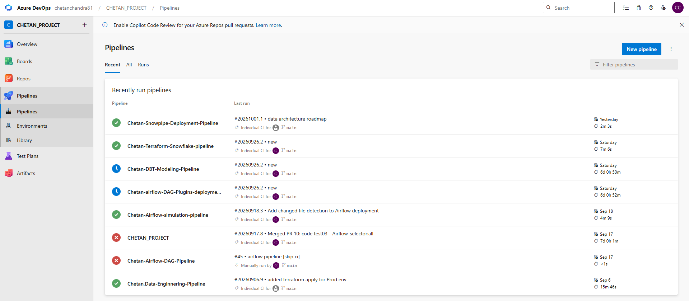
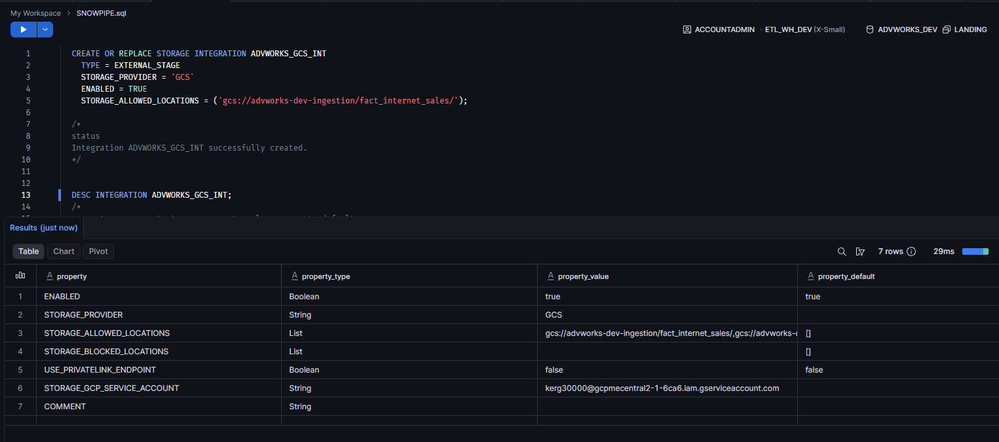
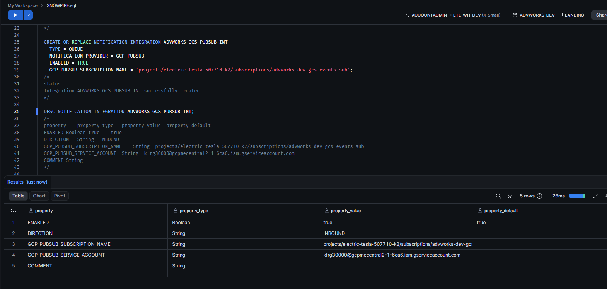
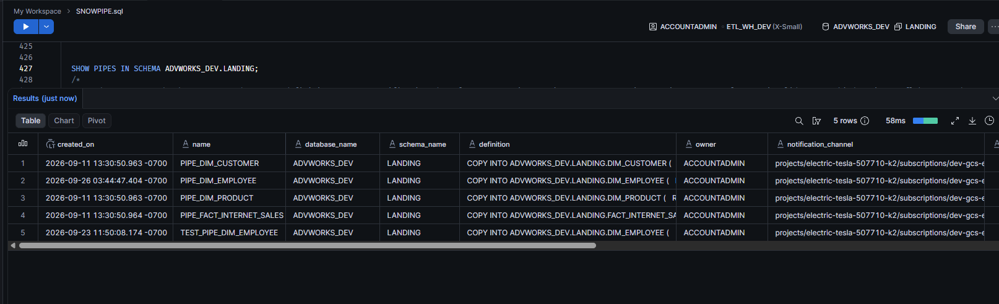
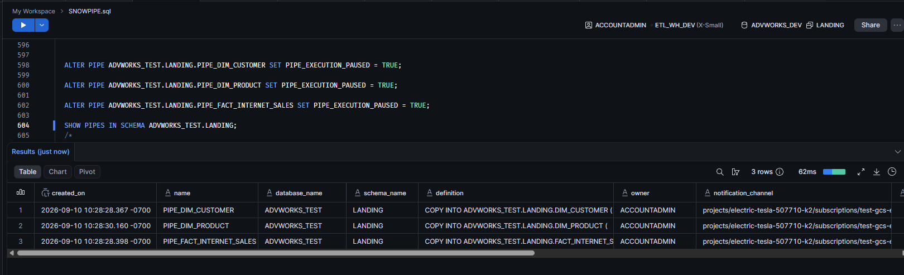
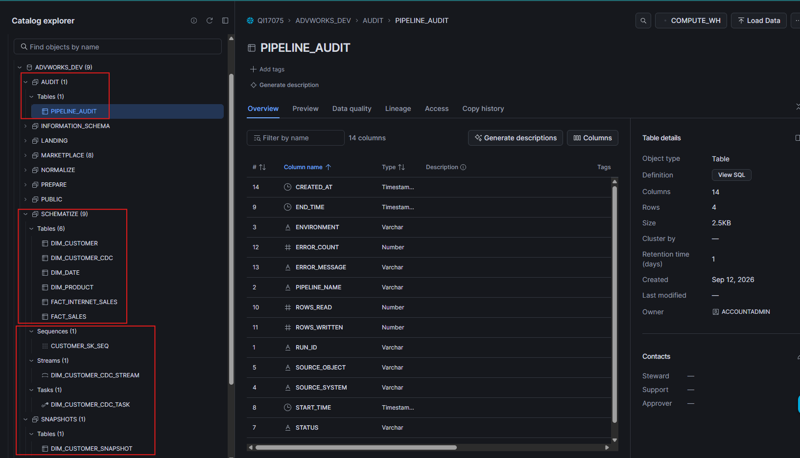
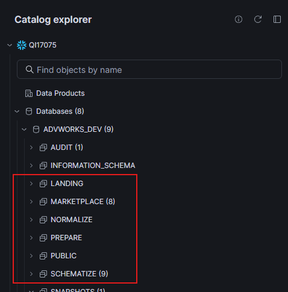
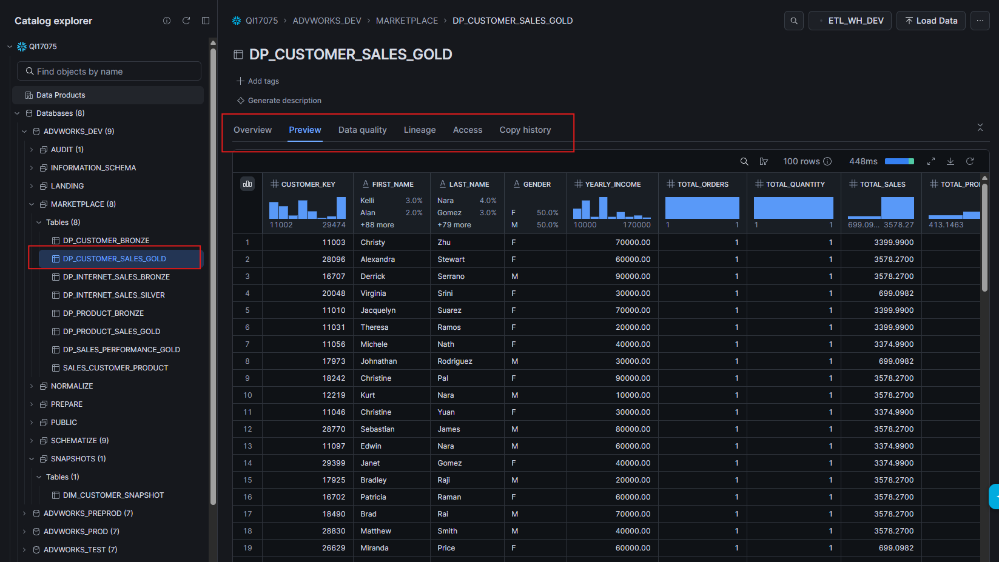
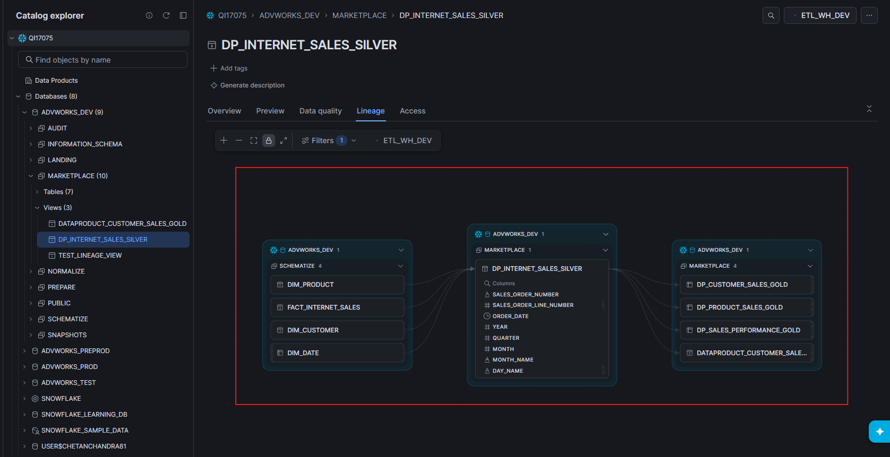
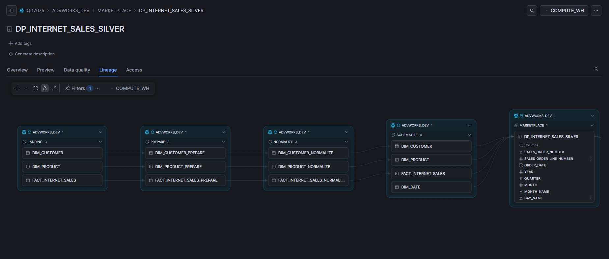

# End-to-End Data Engineering Pipeline

A production-style **Data Engineering practice platform** built around the AdventureWorksDW2022 sample warehouse.

This project demonstrates the complete data lifecycle:

**SQL Server → Python → Airflow → GCS → Pub/Sub → Snowpipe → Snowflake → dbt → Dimensional Model → Marketplace / BI**

Supporting the platform are **Terraform, GCP IAM, Workload Identity Federation, Azure DevOps CI/CD, data-quality checks, incremental processing, CDC, SCD Type 2, monitoring and production-recovery patterns**.

> **Project Status: ✅ Core implementation completed and validated**
>
> This is a hands-on learning and portfolio project. It intentionally simulates enterprise architecture and production practices, but is not presented as a production system serving real business users.

---

# 1. Project Objective

The objective was to design and implement an end-to-end modern Data Engineering platform and understand not only how individual tools work, but **why each component exists and how the components interact**.

The project covers:

* SQL Server source connectivity
* Python extraction and batch processing
* JSON / JSONL file generation
* Google Cloud Storage
* Apache Airflow orchestration
* Google Pub/Sub event notification
* Snowflake external stages and storage integrations
* Snowpipe automated ingestion
* Snowflake LANDING / PREPARE / NORMALIZE / SCHEMATIZE / MARKETPLACE layers
* dbt transformations and lineage
* Dimensional data modeling
* dbt data-quality tests
* dbt Snapshots / SCD Type 2
* Snowflake Streams and Tasks / CDC
* Incremental processing concepts
* Terraform Infrastructure as Code
* Remote Terraform state in GCS
* Environment isolation
* Azure DevOps CI/CD
* Workload Identity Federation
* Secure key handling
* Error handling, retry and idempotency patterns
* Monitoring and operational validation
* Performance and cost considerations
* Production architecture and failure scenarios

The project follows:

```text
Learn → Implement → Validate → Understand → Interview Scenario → Move On
```

---

# 2. Architecture

## 2.1 Runtime Data Architecture

```text
┌──────────────────────────────┐
│ SQL Server                   │
│ AdventureWorksDW2022         │
└──────────────┬───────────────┘
               │
               │ Python extraction
               ▼
┌──────────────────────────────┐
│ Apache Airflow               │
│ Orchestration / scheduling   │
└──────────────┬───────────────┘
               │
               │ Upload
               ▼
┌──────────────────────────────┐
│ Google Cloud Storage         │
│ Raw ingestion layer          │
└──────────────┬───────────────┘
               │
               │ Object-created event
               ▼
┌──────────────────────────────┐
│ Google Pub/Sub               │
│ Event notification           │
└──────────────┬───────────────┘
               │
               │ Notification
               ▼
┌──────────────────────────────┐
│ Snowpipe                     │
│ Automated ingestion          │
└──────────────┬───────────────┘
               │
               ▼
┌──────────────────────────────────────────────┐
│ Snowflake                                    │
│                                              │
│ LANDING     → Raw VARIANT ingestion          │
│ PREPARE     → Type / structure normalization │
│ NORMALIZE   → Cleansing / deduplication      │
│ SCHEMATIZE  → Dimensional model              │
│ MARKETPLACE → Business-ready datasets        │
└──────────────────────┬───────────────────────┘
                       │
                       │ dbt
                       ▼
              ┌─────────────────┐
              │ BI / Analytics  │
              │ Tableau / Power │
              │ BI             │
              └─────────────────┘
```

### Architectural responsibility

| Component          | Primary responsibility              |
| ------------------ | ----------------------------------- |
| SQL Server         | Source system                       |
| Python             | Extraction / file generation        |
| Airflow            | Ingestion orchestration             |
| GCS                | Durable raw object storage          |
| Pub/Sub            | Event notification                  |
| Snowpipe           | Automated Snowflake ingestion       |
| Snowflake          | Warehouse / storage / compute       |
| dbt                | Transformation / modeling / testing |
| Terraform          | Infrastructure provisioning         |
| Azure DevOps       | CI/CD / deployment                  |
| WIF                | Federated GCP authentication        |
| GitHub             | Source control                      |
| Tableau / Power BI | Analytics consumption               |

Airflow is intentionally used for **orchestration**, rather than making it responsible for warehouse transformation.

Terraform is responsible for **infrastructure**, dbt for **data transformation**, and Azure DevOps for **deployment automation**.

---

# 3. Technologies

| Area                     | Technology                   |
| ------------------------ | ---------------------------- |
| Source database          | Microsoft SQL Server         |
| Dataset                  | AdventureWorksDW2022         |
| Programming              | Python                       |
| Connectivity             | pyodbc / ODBC Driver 17      |
| Orchestration            | Apache Airflow               |
| Cloud platform           | Google Cloud Platform        |
| Object storage           | Google Cloud Storage         |
| Messaging                | Google Pub/Sub               |
| Data warehouse           | Snowflake                    |
| Automated ingestion      | Snowpipe                     |
| Transformation           | dbt                          |
| Modeling                 | Dimensional / Star Schema    |
| Infrastructure           | Terraform                    |
| Remote state             | GCS                          |
| CI/CD                    | Azure DevOps Pipelines       |
| Federated authentication | Workload Identity Federation |
| Version control          | Git / GitHub                 |
| BI                       | Tableau / Power BI           |
| Platform concepts        | Docker / Kubernetes / GKE    |
| Metadata database        | PostgreSQL                   |
| Message broker concepts  | RabbitMQ / CloudAMQP         |

---

# 4. Project Structure

```text
Data-pipeline-end-to-end/
│
├── CI_CD_Pipeline/
├── data/
│
├── DBT/
│   ├── advworks_dbt/
│   │   ├── analyses/
│   │   ├── logs/
│   │   ├── macros/
│   │   ├── models/
│   │   │   ├── landing/
│   │   │   ├── prepare/
│   │   │   ├── normalize/
│   │   │   ├── schematize/
│   │   │   └── marketplace/
│   │   ├── snapshots/
│   │   ├── tests/
│   │   ├── dbt_project.yml
│   │   └── README.md
│   └── logs/
│
├── Interview_related/
├── logs/
│
├── python-ingestion/
│   ├── output/
│   ├── storage/
│   ├── storage_bucket/
│   ├── Stage_1_extract_customer.py
│   ├── Stage_2_extract_customer.py
│   ├── Stage_3_extract_customer.py
│   ├── Stage_4_extract.py
│   ├── Stage_4_validate_extraction.py
│   ├── Stage_6_extract_fact_internet_sales.py
│   └── test_connection.py
│
├── source-db/
├── Snowflake/
├── Syllabus_and_Steps_StageWise/
│
├── terraform/
│   ├── environments/
│   │   ├── dev.tfvars
│   │   ├── test.tfvars
│   │   ├── preprod.tfvars
│   │   └── prod.tfvars
│   ├── main.tf
│   ├── outputs.tf
│   ├── variables.tf
│   ├── versions.tf
│   └── .terraform.lock.hcl
│
├── templates/
│   ├── terraform-plan.yml
│   └── terraform-apply.yml
│
├── azure-pipelines.yml
├── azure-pipelines-debug-wif.yml
├── .gitignore
├── README.md
└── Data-pipeline-end-to-end.code-workspace
```

Generated data, Terraform state, private keys, passphrases and secrets are intentionally excluded from Git.

---

# 5. Source Database

```text
Microsoft SQL Server
        │
        ▼
AdventureWorksDW2022
```

Primary tables:

```text
dbo.DimCustomer
dbo.DimProduct
dbo.FactInternetSales
```

Source configuration:

```text
Server: CHETAN\SQLSERVER2022
Database: AdventureWorksDW2022
Driver: ODBC Driver 17 for SQL Server
Authentication: Windows Authentication
```

---

# 6. Python Extraction

## Status: ✅ Completed and validated

Implemented:

* SQL Server connectivity
* pyodbc
* batch extraction
* deterministic ordering
* JSON / JSONL generation
* extraction validation
* duplicate detection
* row-count validation
* reusable storage abstraction
* customer extraction
* FactInternetSales extraction

### FactInternetSales validation

```text
Source table: dbo.FactInternetSales
Rows: 60,398
Batch size: 5,000
Output format: JSONL
Generated batches: 13
Duplicate order lines: 0
```

Deterministic ordering uses:

```text
SalesOrderNumber
SalesOrderLineNumber
```

This makes extraction reproducible and easier to validate and reprocess.

---

# 7. GCS Raw Ingestion

## Status: ✅ Completed and validated

```text
SQL Server
    ↓
Python
    ↓
JSONL
    ↓
GCS Raw Zone
```

Implemented concepts:

* GCS authentication
* bucket structure
* object naming
* raw-zone organization
* date-based paths
* upload validation
* object existence validation
* metadata
* retry handling
* idempotent upload patterns

Example:

```text
gs://advworks-dev-ingestion/

├── customer/
│   └── YYYY/MM/DD/
│
└── fact_internet_sales/
    └── YYYY/MM/DD/
```

---

# 8. Apache Airflow

## Status: ✅ Completed and validated

Airflow is responsible for **source ingestion orchestration**.

Example DAG:

```text
Extract
   ↓
Validate
   ↓
Generate JSONL
   ↓
Upload to GCS
   ↓
Validate GCS Object
```

Implemented / practiced:

* DAGs
* tasks
* dependencies
* scheduling
* retries
* failure handling
* logging
* task monitoring
* idempotency
* backfill / catchup concepts

The project also includes Docker / Kubernetes / GKE-oriented Airflow deployment concepts.

---

# 9. Snowflake Ingestion

## Status: ✅ Completed and validated

Snowflake environments:

```text
ADVWORKS_DEV
ADVWORKS_TEST
ADVWORKS_PREPROD
ADVWORKS_PROD
```

Warehouses:

```text
ETL_WH_DEV
ETL_WH_TEST
ETL_WH_PREPROD
ETL_WH_PROD
```

Schemas:

```text
LANDING
PREPARE
NORMALIZE
SCHEMATIZE
MARKETPLACE
```

Ingestion:

```text
GCS
 ↓
External Stage
 ↓
File Format
 ↓
Snowpipe
 ↓
LANDING
```

Implemented:

* external stages
* storage integrations
* file formats
* Snowpipe
* load history
* file tracking
* source-file lineage
* ingestion validation
* error handling

---

# 10. Event-Driven Ingestion

## Status: ✅ Completed and validated

```text
GCS object created
       ↓
Google Pub/Sub
       ↓
Snowflake notification integration
       ↓
Snowpipe
       ↓
Snowflake LANDING
```

A DEV end-to-end ingestion test validated:

```text
GCS
 ↓
Pub/Sub
 ↓
Snowpipe
 ↓
ADVWORKS_DEV.LANDING.DIM_CUSTOMER
```

The test validated:

* event generation
* notification delivery
* Snowpipe ingestion
* loaded row count
* source-file lineage
* pending-file count returning to zero

---

# 11. dbt Transformation Architecture

## Status: ✅ Completed and validated

```text
LANDING
   ↓
PREPARE
   ↓
NORMALIZE
   ↓
SCHEMATIZE
   ↓
MARKETPLACE
```

### PREPARE

* parse VARIANT data
* cast source fields
* standardize data types
* expose relational columns
* preserve source metadata

### NORMALIZE

* cleansing
* trimming
* casing
* deduplication
* type standardization
* latest-record selection

### SCHEMATIZE

* dimensional model
* facts
* dimensions
* business keys
* analytical relationships

### MARKETPLACE

* business-facing datasets
* analytics-ready outputs
* simplified consumption models

---

# 12. Validated dbt Model Counts

```text
PREPARE
Customer: 18,484
Product: 606
Fact: 60,398

NORMALIZE
Customer: 18,484
Product: 606
Fact: 60,398

SCHEMATIZE
Customer: 18,484
Product: 606
Date: 10,000
Fact: 60,398

MARKETPLACE
Fact: 60,398
```

---

# 13. dbt Data Quality

## Status: ✅ Implemented and validated

Implemented validation:

* duplicate detection
* referential integrity
* fact/dimension integrity
* row-count validation
* business-level validation

Validated:

```text
dbt tests: 4 / 4 passed
```

---

# 14. Dimensional Data Modeling

## Status: ✅ Completed

Core dimensions:

```text
DIM_CUSTOMER
DIM_PRODUCT
DIM_DATE
```

Core fact:

```text
FACT_INTERNET_SALES
```

Concepts implemented:

* grain definition
* fact vs dimension separation
* business keys
* dimensional modeling
* star schema
* referential integrity
* role-playing dates

Example:

```text
                 DIM_CUSTOMER
                      │
                      ▼
DIM_PRODUCT ─────► FACT_SALES ◄───── DIM_DATE
                      │
                      ▼
                 BI / Analytics
```

---

# 15. dbt Snapshots / SCD Type 2

## Status: ✅ Completed and validated

A dbt Snapshot was implemented for customer history.

The implementation demonstrates:

```text
Current record
     ↓
Business change
     ↓
Close old version
     ↓
Create new version
```

Snapshot metadata:

```text
DBT_SCD_ID
DBT_UPDATED_AT
DBT_VALID_FROM
DBT_VALID_TO
```

A controlled test changed customer `11000` from:

```text
YEARLY_INCOME = 90,000
```

to:

```text
YEARLY_INCOME = 95,000
```

The snapshot produced:

```text
Old version
DBT_VALID_TO = change timestamp

New version
DBT_VALID_TO = NULL
```

Validation:

```text
CUSTOMER_KEY = 11000
VERSION_COUNT = 2
CURRENT_VERSION_COUNT = 1
```

### Production consideration

A production implementation should preferably use the **source business-change timestamp** rather than an ingestion timestamp such as `LOAD_TIMESTAMP`, otherwise unchanged records re-ingested with a new ingestion timestamp can create false historical versions.

---

# 16. Snowflake Streams + Tasks / CDC

## Status: ✅ Completed and validated

Architecture:

```text
NORMALIZE.DIM_CUSTOMER_NORMALIZE
             │
             ▼
        Snowflake Stream
             │
             ▼
        Snowflake Task
             │
             ▼
       CDC Target Table
```

The project validated:

### INSERT

```text
METADATA$ACTION = INSERT
METADATA$ISUPDATE = FALSE
```

### UPDATE

Snowflake exposes an update as:

```text
DELETE + ISUPDATE=TRUE
        +
INSERT + ISUPDATE=TRUE
```

### DELETE

```text
METADATA$ACTION = DELETE
METADATA$ISUPDATE = FALSE
```

The Task handles:

```text
INSERT + ISUPDATE=FALSE → INSERT
INSERT + ISUPDATE=TRUE  → UPDATE
DELETE + ISUPDATE=FALSE → DELETE
DELETE + ISUPDATE=TRUE  → ignore update's delete half
```

Validation included:

* successful Task execution
* update propagation
* delete propagation
* stream consumption
* `SYSTEM$STREAM_HAS_DATA()` returning `FALSE`
* target-table validation

---

# 17. Incremental Processing

## Status: 🟡 Advanced dbt learning / hardening area

The project also covers:

* watermarks
* high-water marks
* `is_incremental()`
* `unique_key`
* Snowflake `MERGE`
* late-arriving data
* full refresh
* incremental vs CDC
* idempotency

Core pattern:

```text
First run
   ↓
Full dataset
   ↓
Persist target

Later run
   ↓
Read records newer than watermark
   ↓
Deduplicate
   ↓
MERGE
   ↓
Insert new / update existing
```

Production considerations:

* late-arriving records
* out-of-order timestamps
* duplicate events
* multiple changes for one key
* watermark recovery
* backfills
* full refresh
* idempotency

This is deliberately classified as an advanced hardening area rather than overstating that every production edge case has been solved.

---

# 18. Terraform Infrastructure as Code

## Status: ✅ Completed and validated

Implemented:

* provider configuration
* Snowflake databases
* Snowflake schemas
* Snowflake warehouses
* stages
* file formats
* Snowpipes
* notification integrations
* environment-specific variables
* remote state
* GCS backend
* state locking
* environment isolation
* plan / apply workflow
* Terraform validation

Versions:

```text
Terraform: 1.15.8
Snowflake Provider: 2.20.0
```

---

# 19. Environment Strategy

```text
DEV
 ↓
TEST
 ↓
PRE-PROD
 ↓
PROD
```

Snowflake:

```text
ADVWORKS_DEV
ADVWORKS_TEST
ADVWORKS_PREPROD
ADVWORKS_PROD
```

Warehouses:

```text
ETL_WH_DEV
ETL_WH_TEST
ETL_WH_PREPROD
ETL_WH_PROD
```

Terraform state:

```text
terraform/state/dev
terraform/state/test
terraform/state/preprod
terraform/state/prod
```

---

# 20. Remote Terraform State

## Status: ✅ Completed

Remote state:

```text
gs://electric-tesla-507710-k2-tfstate/
```

Example:

```text
terraform/state/dev/default.tfstate
terraform/state/test/default.tfstate
terraform/state/preprod/default.tfstate
terraform/state/prod/default.tfstate
```

Practiced:

* remote state
* locking
* state isolation
* state recovery
* environment-specific initialization
* shared state management

---

# 21. Azure DevOps CI/CD

## Status: ✅ Completed and validated

Pipeline responsibilities:

* Python validation
* dbt validation
* Terraform validation
* Google Cloud authentication
* Terraform initialization
* Terraform plan
* environment promotion
* approvals
* Terraform apply

Pipeline:

```text
GitHub
   ↓
Azure DevOps
   ↓
Python Validation
   ↓
dbt Validation
   ↓
Terraform Validation
   ↓
GCP WIF Authentication
   ↓
Terraform Plan
   ↓
Environment Approval
   ↓
Terraform Apply
```

Environment promotion:

```text
DEV
 ↓
TEST
 ↓
PRE-PROD
 ↓
PROD
```

---

# 22. Workload Identity Federation

## Status: ✅ Completed and validated

```text
Azure DevOps
      │
      │ OIDC token
      ▼
Google Workload Identity Provider
      │
      ▼
Workload Identity Pool
      │
      ▼
Terraform CI Service Account
      │
      ▼
GCP Resources
```

Benefits:

* no long-lived GCP service-account key in Azure DevOps
* short-lived credentials
* federated authentication
* reduced credential exposure
* enterprise-oriented CI/CD authentication

Key concepts:

* OIDC
* JWT
* workload identity pool
* workload identity provider
* service-account impersonation

---

# 23. Security

## Status: ✅ Implemented / practiced

Security practices include:

* `.gitignore` for secrets
* private keys excluded from Git
* Snowflake passphrases excluded from Git
* Azure DevOps secret variables
* Azure DevOps secure files
* GCP Workload Identity Federation
* short-lived cloud authentication
* environment separation
* remote Terraform state
* IAM
* least-privilege principles
* Snowflake RBAC concepts

Sensitive credentials should never be committed to the repository.

---

# 24. Error Handling, Retry & Idempotency

## Status: ✅ Implemented / practiced

Production failure pattern:

```text
File arrives
     ↓
Validate
     ↓
Process
     ↓
Success ─────────► Complete
     │
     └── Failure
           ↓
         Retry
           ↓
         Retry
           ↓
       Recover / Reprocess
```

Covered:

* retry strategies
* exponential backoff
* failed records
* duplicate files
* idempotent processing
* checkpointing
* partial failure
* transaction boundaries
* replay / reprocessing
* recovery

The project distinguishes between:

```text
Retryable failure
```

and:

```text
Non-retryable / data-quality failure
```

---

# 25. Monitoring & Operational Validation

## Status: 🟡 Foundation implemented

Operational validation covered:

* Airflow task execution
* GCS objects
* Pub/Sub events
* Snowpipe ingestion
* Snowflake load status
* dbt execution
* dbt tests
* Terraform plan/apply
* Azure DevOps stages
* CDC stream consumption

Important production metrics:

```text
Pipeline duration
Data freshness
Rows processed
Rows rejected
Failed tasks
Snowpipe pending files
dbt test failures
SLA status
```

The project demonstrates monitoring patterns rather than claiming to operate a 24x7 enterprise monitoring platform.

---

# 26. Performance & Cost

## Status: 🟡 Implemented / analyzed

### Python

* batch size
* memory usage
* deterministic extraction
* incremental extraction
* streaming considerations

### GCS

* file sizing
* object organization
* partitioning
* compression considerations

### Snowflake

* warehouse sizing
* auto-suspend
* auto-resume
* query optimization
* micro-partitions
* clustering considerations
* caching
* warehouse cost awareness

### dbt

* materialization selection
* incremental models
* dependency management
* avoiding unnecessary full refreshes
* transformation pushdown

### Airflow

* task concurrency
* scheduling
* retries
* executor considerations

---

# 27. Production Architecture Patterns

### Reliability

* retries
* idempotency
* checkpoints
* replay
* validation
* failure isolation

### Scalability

* batch extraction
* object storage
* event-driven ingestion
* incremental processing
* parallelizable tasks

### Security

* IAM
* WIF
* secure files
* private keys outside Git
* environment separation
* least privilege

### Maintainability

* Terraform
* dbt
* layered architecture
* CI/CD
* reusable Python components

### Data Quality

* source validation
* duplicate detection
* referential integrity
* dbt tests
* row-count checks
* business validation

---

# 28. Final End-to-End Data Flow

```text
AdventureWorksDW2022
        │
        ▼
SQL Server
        │
        ▼
Python Extraction
        │
        ▼
Apache Airflow
        │
        ▼
Google Cloud Storage
        │
        ▼
Google Pub/Sub
        │
        ▼
Snowpipe
        │
        ▼
Snowflake LANDING
        │
        ▼
dbt PREPARE
        │
        ▼
dbt NORMALIZE
        │
        ▼
dbt SCHEMATIZE
        │
        ▼
dbt MARKETPLACE
        │
        ▼
Tableau / Power BI
```

Supporting:

```text
Terraform
Azure DevOps
GitHub
GCP IAM
Workload Identity Federation
Snowflake RBAC
Monitoring / Logging
```

---

# 29. Validation Summary

| Area                            | Status     |
| ------------------------------- | ---------- |
| SQL Server connectivity         | ✅          |
| Python extraction               | ✅          |
| Batch processing                | ✅          |
| JSON / JSONL                    | ✅          |
| GCS ingestion                   | ✅          |
| Airflow orchestration           | ✅          |
| Pub/Sub eventing                | ✅          |
| Snowpipe ingestion              | ✅          |
| Snowflake LANDING               | ✅          |
| dbt PREPARE                     | ✅          |
| dbt NORMALIZE                   | ✅          |
| dbt SCHEMATIZE                  | ✅          |
| dbt MARKETPLACE                 | ✅          |
| Dimensional modeling            | ✅          |
| dbt data-quality tests          | ✅          |
| dbt Snapshot / SCD2             | ✅          |
| Snowflake Streams               | ✅          |
| Snowflake Tasks                 | ✅          |
| CDC insert/update/delete        | ✅          |
| Terraform IaC                   | ✅          |
| Remote Terraform state          | ✅          |
| Environment separation          | ✅          |
| Azure DevOps CI/CD              | ✅          |
| GCP WIF                         | ✅          |
| Security practices              | ✅          |
| Retry / idempotency patterns    | ✅          |
| Monitoring foundation           | 🟡         |
| Advanced incremental edge cases | 🟡         |
| Enterprise 24x7 operations      | Conceptual |

---

# 30. Evidence / Screenshots

The repository should contain **selected evidence rather than dozens of screenshots**.

## Screenshot 01 — Final Architecture




## Screenshot 02 — Airflow DAG Success


## Screenshot 03 — GCS Raw Ingestion

**[SCREENSHOT PLACEHOLDER — GCS BUCKET]**

Capture a representative JSON/JSONL object inside:

```text
advworks-dev-ingestion/
```

Show the raw-zone folder/object structure.

---

## Screenshot 04 — Pub/Sub Event

**[SCREENSHOT PLACEHOLDER — PUB/SUB]**

Capture the Pub/Sub topic/subscription configuration demonstrating the GCS object-created notification path.

---

## Screenshot 05 — Snowpipe Successful Load



**[SCREENSHOT PLACEHOLDER — SNOWPIPE]**








---

## Screenshot 06 — Snowflake Layered Warehouse

**[SCREENSHOT PLACEHOLDER — SNOWFLAKE LAYERS]**




## Screenshot 07 — dbt Lineage

**[SCREENSHOT PLACEHOLDER — DBT LINEAGE]**








---

## Screenshot 08 — dbt Data Quality

**[SCREENSHOT PLACEHOLDER — DBT TESTS]**

Capture:

```text
4 / 4 tests passed
```

Include the relevant test names if visible.

---

## Screenshot 09 — dbt Snapshot / SCD2

**[SCREENSHOT PLACEHOLDER — SCD2 HISTORY]**

Capture customer `11000` showing:

```text
Version 1
YEARLY_INCOME = 90000
DBT_VALID_TO = change timestamp

Version 2
YEARLY_INCOME = 95000
DBT_VALID_TO = NULL
```

This is particularly valuable because it visually proves historical tracking.

---

## Screenshot 10 — Snowflake Streams + Tasks CDC

**[SCREENSHOT PLACEHOLDER — CDC]**

Capture:

```text
NORMALIZE
   ↓
STREAM
   ↓
TASK
   ↓
CDC TARGET
```

Ideally show an UPDATE represented as:

```text
DELETE + ISUPDATE=TRUE
INSERT + ISUPDATE=TRUE
```

---

## Screenshot 11 — Terraform Plan

**[SCREENSHOT PLACEHOLDER — TERRAFORM PLAN]**

Capture a successful Terraform plan.

Do not show credentials or private-key information.

---

## Screenshot 12 — Azure DevOps Pipeline

**[SCREENSHOT PLACEHOLDER — AZURE DEVOPS CI/CD]**

Capture the pipeline showing:

```text
Validation
   ↓
WIF
   ↓
DEV
   ↓
TEST
   ↓
PRE-PROD
   ↓
PROD
```

Include approval gates if visible.

---

## Screenshot 13 — Workload Identity Federation

**[SCREENSHOT PLACEHOLDER — GCP WIF]**

Capture the WIF configuration showing external identity federation.

Do not expose tokens or credentials.

---

## Screenshot 14 — Repository

**[SCREENSHOT PLACEHOLDER — GITHUB REPOSITORY]**

Capture the repository root showing:

```text
python-ingestion/
DBT/
terraform/
CI_CD_Pipeline/
source-db/
Snowflake/
```

---

# 31. Screenshot Priority

If you can only add a limited number, prioritize:

```text
1. Final architecture
2. Airflow successful DAG
3. GCS object
4. Pub/Sub notification
5. Snowpipe successful load
6. Snowflake layered model
7. dbt lineage
8. dbt tests
9. dbt Snapshot / SCD2
10. Snowflake Streams + Tasks CDC
11. Azure DevOps pipeline
12. Terraform plan
13. WIF
```

Together these tell the complete engineering story:

```text
Source
  ↓
Extraction
  ↓
Orchestration
  ↓
Cloud Storage
  ↓
Eventing
  ↓
Automated Ingestion
  ↓
Warehouse
  ↓
Transformation
  ↓
Data Quality
  ↓
Historical Tracking
  ↓
CDC
  ↓
Infrastructure
  ↓
CI/CD
  ↓
Security
```

---

# 32. Security Notice for Screenshots

Never expose:

* passwords
* private keys
* Snowflake passphrases
* access tokens
* JWTs
* service-account keys
* secret variables
* connection strings containing credentials
* personal authentication information

Screenshots should demonstrate architecture and successful execution, not credentials.

---

# 33. Interview Relevance

This project was built to strengthen Data Engineering and Data Architecture interview readiness.

### SQL

* joins
* CTEs
* window functions
* aggregations
* incremental extraction
* query optimization

### Python

* database connectivity
* batch processing
* file processing
* exception handling
* logging
* memory considerations

### Airflow

* DAG design
* task dependencies
* scheduling
* retries
* failure handling
* idempotency
* orchestration vs transformation

### GCP

* GCS
* Pub/Sub
* IAM
* service accounts
* Workload Identity Federation
* event-driven architecture

### Snowflake

* warehouses
* databases
* schemas
* stages
* file formats
* Snowpipe
* Streams
* Tasks
* micro-partitions
* RBAC
* performance and cost

### dbt

* models
* sources
* tests
* macros
* materializations
* snapshots
* incremental models
* lineage
* SCD Type 2

### Terraform

* providers
* resources
* variables
* state
* remote backends
* state locking
* environment management
* plan vs apply

### CI/CD

* pipeline stages
* validation
* approvals
* environment promotion
* secure files
* federated authentication
* infrastructure deployment

### Production scenarios

* duplicate files
* retries
* late-arriving data
* schema changes
* data-quality failures
* incremental loads
* CDC
* backfills
* replay
* disaster recovery
* cost optimization
* security

---

# 34. Key Architectural Lessons

## 1. Separate responsibilities

```text
Airflow      → orchestration
GCS          → raw storage
Pub/Sub      → eventing
Snowpipe     → ingestion
Snowflake    → warehouse
dbt          → transformation
Terraform    → infrastructure
Azure DevOps → deployment
```

## 2. Make pipelines observable

A pipeline should prove:

* expected data arrived
* expected records arrived
* duplicates were controlled
* transformations succeeded
* quality checks passed
* downstream state is correct

## 3. Design for failure

Production systems must assume:

```text
network failure
source failure
duplicate file
partial load
schema change
bad data
downstream outage
expired credentials
```

## 4. Infrastructure should be reproducible

Terraform provides repeatable infrastructure deployment across environments.

## 5. Security belongs in the architecture

The project demonstrates:

```text
WIF
IAM
secure files
private-key authentication
environment isolation
secret exclusion from Git
```

## 6. Batch, CDC and SCD2 solve different problems

```text
Batch / Incremental
→ process new or changed data

CDC
→ capture source changes

Snapshot / SCD2
→ preserve historical versions
```

Understanding this distinction is important for Data Architecture decisions.

---

# 35. Project Completion Summary

The project evolved from a simple SQL extraction exercise into a complete production-style Data Engineering platform:

```text
SQL Server
    ↓
Python
    ↓
Airflow
    ↓
GCS
    ↓
Pub/Sub
    ↓
Snowpipe
    ↓
Snowflake LANDING
    ↓
dbt PREPARE
    ↓
dbt NORMALIZE
    ↓
dbt SCHEMATIZE
    ↓
dbt MARKETPLACE
    ↓
BI
```

With supporting capabilities:

```text
Terraform
    ↓
Infrastructure as Code

Azure DevOps
    ↓
CI/CD

WIF + IAM
    ↓
Secure cloud authentication

dbt Tests
    ↓
Data Quality

Snapshots
    ↓
Historical Tracking

Streams + Tasks
    ↓
CDC

Monitoring / Logging
    ↓
Operational Reliability
```

---

# 36. Final Project Status

```text
╔══════════════════════════════════════════════╗
║        END-TO-END PROJECT COMPLETE           ║
╠══════════════════════════════════════════════╣
║ SQL Server / Python                  ✅       ║
║ GCS                                  ✅       ║
║ Airflow                              ✅       ║
║ Pub/Sub                              ✅       ║
║ Snowpipe                             ✅       ║
║ Snowflake                            ✅       ║
║ dbt                                  ✅       ║
║ Dimensional Modeling                 ✅       ║
║ Data Quality                         ✅       ║
║ dbt Snapshots / SCD2                 ✅       ║
║ Snowflake Streams / Tasks / CDC      ✅       ║
║ Terraform                            ✅       ║
║ Remote Terraform State               ✅       ║
║ Azure DevOps CI/CD                   ✅       ║
║ Workload Identity Federation         ✅       ║
║ Security Practices                   ✅       ║
║ Retry / Idempotency Patterns         ✅       ║
║ Monitoring Foundation                🟡       ║
║ Advanced Incremental Edge Cases      🟡       ║
║ Enterprise 24x7 Operations           Concept  ║
╚══════════════════════════════════════════════╝
```

The project is considered **complete as a Data Engineering learning and portfolio implementation**.

The remaining 🟡 areas represent deeper production-hardening topics rather than missing core pipeline components.

---

# 37. Repository

GitHub:

```text
Chetanchandra1994/Data-pipeline-end-to-end
```

Main branch:

```text
main
```

---

# 38. Disclaimer

This is a personal Data Engineering learning and portfolio project using the AdventureWorks sample dataset.

The architecture is intentionally designed to simulate enterprise Data Engineering practices and demonstrate hands-on understanding of:

* data ingestion
* orchestration
* cloud storage
* event-driven architecture
* Snowflake
* dbt
* CDC
* SCD Type 2
* Infrastructure as Code
* CI/CD
* security
* data quality
* reliability
* production architecture

It should not be interpreted as a production system serving real customer data or as evidence of operating a production environment at enterprise scale.
